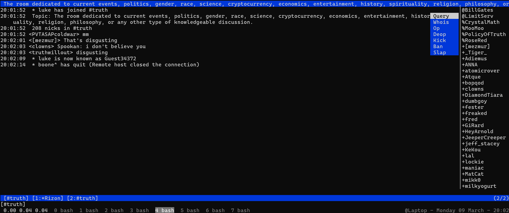

A terminal IRC client written in Python.



```
Usage: scroll [--help]

scroll is a minimal irssi-inspired IRC client.

Configuration is read from config.hcl (searched in the project directory,
~/.config/scroll/config.hcl, and ~/.scroll/config.hcl).

config.hcl keys:
  nick      = "yournick"
  realname  = "Your Name"
  ident     = "ident"
  servers   = [{ name = "Rizon", host = "irc.rizon.net", port = 6667 }]

Key bindings:
  Ctrl+N / Ctrl+P   next / previous buffer
  Alt+1 .. Alt+9    jump directly to buffer N
  Ctrl+W            delete last word in input
  Ctrl+U            clear input line
  Ctrl+L            force redraw
  Enter             send message / execute command

Commands (type /help inside scroll for full list):
  /join #channel    join a channel
  /part [reason]    leave current channel
  /msg nick text    send a private message
  /nick newnick     change nickname
  /me action        send a CTCP ACTION
  /topic [text]     view or set channel topic
  /names            list nicks in current channel
  /clear            clear current buffer
  /raw command      send raw IRC line
  /server           show connection info
  /quit [message]   disconnect and exit  (alias: /exit)
  /help [command]   show this help
```

## Install

```
pip install -e .
```
